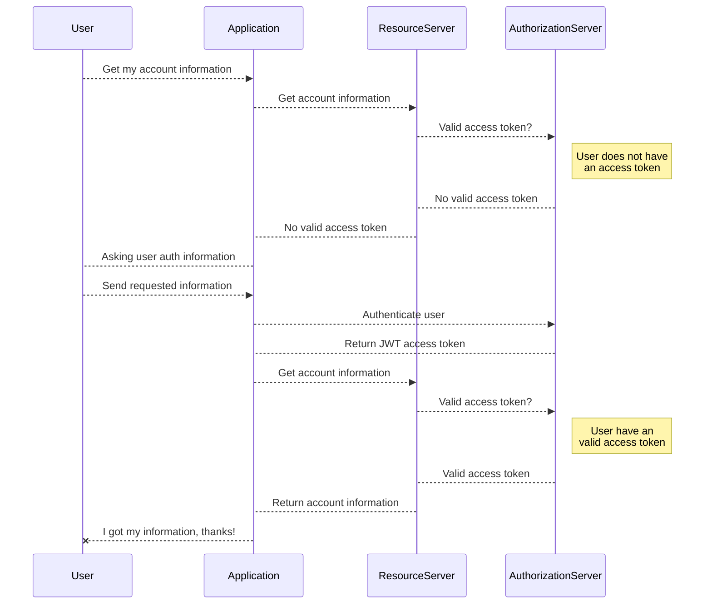

# spring-cloud-simple-authorization-service

This project has the objective to present a sample for a simple authorization server using OAuth flows to authenticate and an user for an application. In this sample I'll not get into OAuth 2.0 details. It is easy to find articles to explain OAuth 2.0 flows (here is a suggestion: https://connect2id.com/learn/oauth-2).

The main idea is to use a grant_type password to get access to a JWT token as an access token. This token gonna be use as a bearer token into requests to grant access to some protected resources. For this demonstration the authorization server gonna be a simple Spring Cloud app and for represent a client requests gonna be done by Postman to represent the access token request and an authorized request using a bearer token.

## Approach

The objective of this sample is present baby steps with details of configurations and Spring Cloud resources used to achieve the final goal of providing an authorization server. The example is far of represent a scenario of production environment, but will make clear why some resources are being used. It might be a starting point.

The OAuth 2.0 flow used for this example is represented above:

## Content sources

 - https://www.devglan.com/spring-security/spring-boot-oauth2-jwt-example
 - https://connect2id.com/learn/oauth-2
 - https://spring.io/blog/2017/11/01/spring-security-5-0-0-rc1-released#password-encoding
 - https://dzone.com/articles/whats-better-oauth-access-tokens-or-json-web-token
